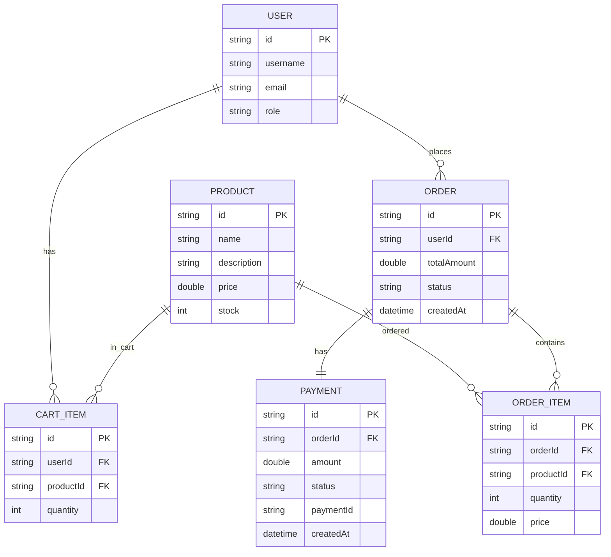

# minicommerce

Basic Spring Boot ecommerce API.

## Requirements
- Java 17
- MongoDB running on localhost:27017

## Run
```
./mvnw spring-boot:run
```

## Configuration
`src/main/resources/application.properties`
- `spring.data.mongodb.uri=mongodb://localhost:27017/ecommerce`
- `app.payment.webhook-url=http://localhost:8080/api/webhooks/payment`

## API
Product
- POST `/api/products`
- GET `/api/products`
- GET `/api/products/search?q=laptop`

Cart
- POST `/api/cart/add`
- GET `/api/cart/{userId}`
- DELETE `/api/cart/{userId}/clear`

Order
- POST `/api/orders`
- GET `/api/orders/{orderId}`
- GET `/api/orders/user/{userId}`
- POST `/api/orders/{orderId}/cancel`

Payment
- POST `/api/payments/create`
- POST `/api/webhooks/payment`

## Sample Requests
Create product
```json
{
  "name": "Laptop",
  "description": "Gaming Laptop",
  "price": 50000.0,
  "stock": 10
}
```

Add to cart
```json
{
  "userId": "user123",
  "productId": "prod123",
  "quantity": 2
}
```

Create order
```json
{
  "userId": "user123"
}
```

Create payment
```json
{
  "orderId": "order123",
  "amount": 100000.0
}
```

## Postman
Collection file: `postman_collection.json`

Collection variables
- `baseUrl`
- `userId`
- `productId`
- `orderId`
- `paymentId`
- `orderAmount`
- `query`

## ER Diagram

